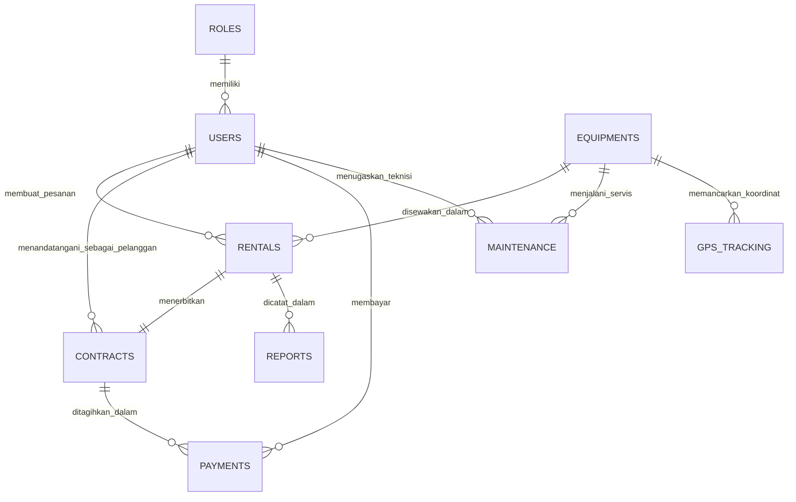

# SPESIFIKASI BASIS DATA TIDB CLOUD SERVERLESS (DATABASE_TIDB.md)
### PT. SURYA BANGUN SARANA BANJARMASIN

Dokumen ini mendokumentasikan arsitektur basis data, skema 9 tabel relasional, konfigurasi konektivitas Edge HTTP, serta kueri analitik operasional pada **TiDB Cloud Serverless**.

---

## 1. ARSITEKTUR BASIS DATA & KONEKTIVITAS EDGE

Sistem EquipRent MS menggunakan **TiDB Cloud Serverless** sebagai basis data terdistribusi (*Distributed SQL Database*) yang berbasis pada arsitektur NewSQL MySQL 8.0:

- **Region Cluster:** `ap-southeast-1` (AWS Singapore — Latensi sangat rendah untuk wilayah Indonesia & Kalimantan Selatan).
- **Endpoint Gateway:** `gateway01.ap-southeast-1.prod.aws.tidbcloud.com`
- **Port:** `4000`
- **Protokol Koneksi Edge:** Driver resmi `@tidbcloud/serverless`.

```
                +───────────────────────────────────────+
                │      Cloudflare Workers V8 Engine     │
                │        (Serverless Edge Runtime)      │
                +───────────────────────────────────────+
                                    │
                       HTTPS REST SQL Tunnel (Port 443)
                      No Raw TCP Socket Constraints!
                                    │
                                    ▼
                +───────────────────────────────────────+
                │         TiDB Cloud Serverless         │
                │   • TiDB Compute Nodes (Stateless)    │
                │   • TiKV Storage Engine (Raft Consensus)│
                │   • MySQL 8.0 Dialect Compatibility   │
                +───────────────────────────────────────+
```

### Mengapa `@tidbcloud/serverless`?
Runtime serverless modern seperti Cloudflare Workers tidak menyediakan akses TCP socket mentah (*raw sockets*) seperti lingkungan Node.js konvensional. Driver `@tidbcloud/serverless` membungkus kueri SQL ke dalam protokol HTTPS aman, memungkinkan eksekusi kueri langsung dari Edge tanpa memerlukan connection pooler pihak ketiga yang kompleks.

---

## 2. DIAGRAM ENTITAS RELASIONAL (ERD)



---

## 3. SKEMA LENGKAP 9 TABEL RELASIONAL (DDL)

### 1. Tabel `roles` (Hak Akses Multi-Role)
Menentukan 3 tingkatan hak akses pengguna dalam sistem.
```sql
CREATE TABLE `roles` (
    `id` INT AUTO_INCREMENT PRIMARY KEY,
    `role_name` VARCHAR(50) NOT NULL UNIQUE,
    `description` TEXT,
    `created_at` TIMESTAMP DEFAULT CURRENT_TIMESTAMP
) ENGINE=InnoDB DEFAULT CHARSET=utf8mb4;

-- Data Seeding:
-- 1 = ADMIN (Superuser Pengendali Sistem)
-- 2 = STAFF (Staf Operasional Lapangan & Verifikasi)
-- 3 = CUSTOMER (Pelanggan / Perusahaan Penyewa)
```

### 2. Tabel `users` (Data Akun & Biodata Pengguna)
Menyimpan informasi kredensial login, nomor kontak, serta instansi perusahaan.
```sql
CREATE TABLE `users` (
    `id` INT AUTO_INCREMENT PRIMARY KEY,
    `role_id` INT NOT NULL,
    `username` VARCHAR(50) NOT NULL UNIQUE,
    `password` VARCHAR(255) NOT NULL,
    `email` VARCHAR(100) NOT NULL UNIQUE,
    `full_name` VARCHAR(100) NOT NULL,
    `phone` VARCHAR(20),
    `address` TEXT,
    `company_name` VARCHAR(100) NULL,
    `status` ENUM('ACTIVE', 'SUSPENDED') DEFAULT 'ACTIVE',
    `created_at` TIMESTAMP DEFAULT CURRENT_TIMESTAMP,
    `updated_at` TIMESTAMP DEFAULT CURRENT_TIMESTAMP ON UPDATE CURRENT_TIMESTAMP,
    FOREIGN KEY (`role_id`) REFERENCES `roles`(`id`) ON DELETE RESTRICT ON UPDATE CASCADE
) ENGINE=InnoDB DEFAULT CHARSET=utf8mb4;
```

### 3. Tabel `equipments` (Master Inventaris Alat Berat & Hour Meter)
Menyimpan spesifikasi teknis mesin, tarif harian sewa, dan jam kerja mesin (*Hour Meter*).
```sql
CREATE TABLE `equipments` (
    `id` INT AUTO_INCREMENT PRIMARY KEY,
    `equipment_code` VARCHAR(50) NOT NULL UNIQUE,
    `name` VARCHAR(100) NOT NULL,
    `type` VARCHAR(50) NOT NULL,
    `model` VARCHAR(50),
    `brand` VARCHAR(50),
    `hour_meter` DECIMAL(10,2) DEFAULT 0.00,
    `rental_price_per_day` DECIMAL(15,2) NOT NULL,
    `status` ENUM('AVAILABLE', 'RENTED', 'MAINTENANCE', 'UNAVAILABLE') DEFAULT 'AVAILABLE',
    `last_maintenance_date` DATE,
    `thumbnail_url` VARCHAR(500),
    `created_at` TIMESTAMP DEFAULT CURRENT_TIMESTAMP,
    `updated_at` TIMESTAMP DEFAULT CURRENT_TIMESTAMP ON UPDATE CURRENT_TIMESTAMP,
    INDEX `idx_equipment_status` (`status`),
    INDEX `idx_equipment_type` (`type`)
) ENGINE=InnoDB DEFAULT CHARSET=utf8mb4;
```

### 4. Tabel `rentals` (Transaksi Penyewaan Alat Berat)
Merekam data pemesanan, tanggal mulai-selesai sewa, durasi hari kerja, serta subtotal biaya.
```sql
CREATE TABLE `rentals` (
    `id` INT AUTO_INCREMENT PRIMARY KEY,
    `rental_code` VARCHAR(50) NOT NULL UNIQUE,
    `customer_id` INT NOT NULL,
    `equipment_id` INT NOT NULL,
    `booking_date` TIMESTAMP DEFAULT CURRENT_TIMESTAMP,
    `start_date` DATE NOT NULL,
    `end_date` DATE NOT NULL,
    `total_days` INT NOT NULL,
    `subtotal` DECIMAL(15,2) NOT NULL,
    `status` ENUM('PENDING', 'APPROVED', 'ON_GOING', 'COMPLETED', 'REJECTED') DEFAULT 'PENDING',
    `notes` TEXT,
    `created_at` TIMESTAMP DEFAULT CURRENT_TIMESTAMP,
    `updated_at` TIMESTAMP DEFAULT CURRENT_TIMESTAMP ON UPDATE CURRENT_TIMESTAMP,
    FOREIGN KEY (`customer_id`) REFERENCES `users`(`id`) ON DELETE RESTRICT ON UPDATE CASCADE,
    FOREIGN KEY (`equipment_id`) REFERENCES `equipments`(`id`) ON DELETE RESTRICT ON UPDATE CASCADE,
    INDEX `idx_rental_status` (`status`)
) ENGINE=InnoDB DEFAULT CHARSET=utf8mb4;
```

### 5. Tabel `contracts` (Kontrak Sewa Digital & Tanda Tangan Elektronik)
Dokumen legalitas kontrak yang ditandatangani pelanggan secara elektronik.
```sql
CREATE TABLE `contracts` (
    `id` INT AUTO_INCREMENT PRIMARY KEY,
    `contract_code` VARCHAR(50) NOT NULL UNIQUE,
    `rental_id` INT NOT NULL UNIQUE,
    `contract_date` DATE NOT NULL,
    `valid_until` DATE NOT NULL,
    `terms_and_conditions` LONGTEXT,
    `is_signed_customer` TINYINT(1) DEFAULT 0,
    `signed_at` TIMESTAMP NULL,
    `created_at` TIMESTAMP DEFAULT CURRENT_TIMESTAMP,
    FOREIGN KEY (`rental_id`) REFERENCES `rentals`(`id`) ON DELETE CASCADE ON UPDATE CASCADE
) ENGINE=InnoDB DEFAULT CHARSET=utf8mb4;
```

### 6. Tabel `payments` (Pencatatan & Verifikasi Pembayaran)
Merekam transaksi transfer bank Mandiri, berkas bukti setor, dan staf yang memverifikasi.
```sql
CREATE TABLE `payments` (
    `id` INT AUTO_INCREMENT PRIMARY KEY,
    `payment_code` VARCHAR(50) NOT NULL UNIQUE,
    `rental_id` INT NOT NULL,
    `payment_date` TIMESTAMP DEFAULT CURRENT_TIMESTAMP,
    `amount` DECIMAL(15,2) NOT NULL,
    `payment_method` VARCHAR(50) DEFAULT 'Bank Mandiri Transfer',
    `payment_proof_path` VARCHAR(255) NULL,
    `status` ENUM('PENDING_VERIFICATION', 'PAID', 'REJECTED') DEFAULT 'PENDING_VERIFICATION',
    `verified_by` INT NULL,
    `created_at` TIMESTAMP DEFAULT CURRENT_TIMESTAMP,
    FOREIGN KEY (`rental_id`) REFERENCES `rentals`(`id`) ON DELETE CASCADE ON UPDATE CASCADE,
    FOREIGN KEY (`verified_by`) REFERENCES `users`(`id`) ON DELETE SET NULL ON UPDATE CASCADE
) ENGINE=InnoDB DEFAULT CHARSET=utf8mb4;
```

### 7. Tabel `maintenance` (Log Servis Berkala & Suku Cadang Mesin)
Jadwal perawatan pencegahan (*Preventive*) dan perbaikan (*Corrective*) berdasarkan akumulasi Hour Meter.
```sql
CREATE TABLE `maintenance` (
    `id` INT AUTO_INCREMENT PRIMARY KEY,
    `maintenance_code` VARCHAR(50) NOT NULL UNIQUE,
    `equipment_id` INT NOT NULL,
    `scheduled_date` DATE NOT NULL,
    `completion_date` DATE NULL,
    `maintenance_type` ENUM('PREVENTIVE', 'CORRECTIVE', 'INSPECTION') DEFAULT 'PREVENTIVE',
    `hour_meter_at_maintenance` DECIMAL(10,2) NOT NULL,
    `description` TEXT,
    `spareparts_replaced` TEXT,
    `cost` DECIMAL(15,2) DEFAULT 0.00,
    `technician_id` INT NULL,
    `status` ENUM('SCHEDULED', 'IN_PROGRESS', 'COMPLETED') DEFAULT 'SCHEDULED',
    `created_at` TIMESTAMP DEFAULT CURRENT_TIMESTAMP,
    FOREIGN KEY (`equipment_id`) REFERENCES `equipments`(`id`) ON DELETE RESTRICT ON UPDATE CASCADE,
    FOREIGN KEY (`technician_id`) REFERENCES `users`(`id`) ON DELETE SET NULL ON UPDATE CASCADE
) ENGINE=InnoDB DEFAULT CHARSET=utf8mb4;
```

### 8. Tabel `gps_tracking` (Telemetri Koordinat Lapangan)
Menyimpan posisi geospasial armada, kecepatan unit, status mesin, dan persentase bahan bakar solar.
```sql
CREATE TABLE `gps_tracking` (
    `id` INT AUTO_INCREMENT PRIMARY KEY,
    `equipment_id` INT NOT NULL,
    `latitude` DECIMAL(10,8) NOT NULL,
    `longitude` DECIMAL(11,8) NOT NULL,
    `speed` DECIMAL(5,2) DEFAULT 0.00,
    `engine_status` ENUM('ON', 'OFF') DEFAULT 'OFF',
    `fuel_level_percent` DECIMAL(5,2) DEFAULT 100.00,
    `recorded_at` TIMESTAMP DEFAULT CURRENT_TIMESTAMP,
    FOREIGN KEY (`equipment_id`) REFERENCES `equipments`(`id`) ON DELETE CASCADE ON UPDATE CASCADE,
    INDEX `idx_gps_equipment_time` (`equipment_id`, `recorded_at`)
) ENGINE=InnoDB DEFAULT CHARSET=utf8mb4;
```

### 9. Tabel `reports` (Log Penerbitan Dokumen Resmi BAST & Surat Jalan)
Riwayat pencetakan Berita Acara Serah Terima (BAST) dan Surat Jalan Mobilisasi Alat.
```sql
CREATE TABLE `reports` (
    `id` INT AUTO_INCREMENT PRIMARY KEY,
    `report_code` VARCHAR(50) NOT NULL UNIQUE,
    `report_type` ENUM('BAST_MOBILISASI', 'BAST_DEMOBILISASI', 'SURAT_JALAN', 'RINGKASAN_OPERASIONAL') NOT NULL,
    `rental_id` INT NULL,
    `generated_by` INT NOT NULL,
    `file_path` VARCHAR(255) NULL,
    `generated_at` TIMESTAMP DEFAULT CURRENT_TIMESTAMP,
    FOREIGN KEY (`rental_id`) REFERENCES `rentals`(`id`) ON DELETE SET NULL ON UPDATE CASCADE,
    FOREIGN KEY (`generated_by`) REFERENCES `users`(`id`) ON DELETE RESTRICT ON UPDATE CASCADE
) ENGINE=InnoDB DEFAULT CHARSET=utf8mb4;
```

---

## 4. STATISTIK DATA AWAL (SEEDING RESMI PT. SBS)

Database TiDB Cloud telah terisi penuh dengan data operasional nyata:

| Nama Tabel | Jumlah Baris (Record) | Keterangan Data Operasional |
| :--- | :--- | :--- |
| `roles` | **3** baris | ADMIN, STAFF, CUSTOMER |
| `users` | **50** akun | Karyawan admin, staf mekanik, dan 42 perusahaan pelanggan Kalsel |
| `equipments` | **50** unit | Excavator PC200, Dozer D85, Tander Roller Sakai, Grader, Crane |
| `rentals` | **50** transaksi | Transaksi sewa aktif, pending, dan selesai di area Kalsel |
| `contracts` | **50** berkas | Kontrak legal terverifikasi dengan stempel waktu E-Sign |
| `payments` | **50** pembayaran | Total omzet sewa terbayar: **Rp 3.270.150.000** |
| `maintenance` | **25** jadwal | Riwayat servis berkala & penggantian spareparts oli mesin |
| `gps_tracking` | **55** koordinat | Titik koordinat GPS di Trisakti, Banjarbaru, Tabalong |
| `reports` | **20** dokumen | Arsip BAST dan Surat Jalan resmi ber-Kop Surat PT. SBS |

---

## 5. KUERI ANALITIK OPERASIONAL UNTUK SKRIPSI

Gunakan contoh kueri SQL di bawah ini untuk presentasi skripsi:

### Kueri 1: Akumulasi Total Pendapatan Sewa Terverifikasi Lunas
```sql
SELECT 
    COUNT(id) AS total_transaksi_lunas,
    SUM(amount) AS total_pendapatan_bersih,
    MIN(payment_date) AS transaksi_pertama,
    MAX(payment_date) AS transaksi_terakhir
FROM payments
WHERE status = 'PAID';
```

### Kueri 2: Tingkat Utilisasi Armada Alat Berat (% Rented vs Available)
```sql
SELECT 
    type AS kategori_alat,
    COUNT(*) AS total_unit,
    SUM(CASE WHEN status = 'RENTED' THEN 1 ELSE 0 END) AS unit_disewa,
    SUM(CASE WHEN status = 'AVAILABLE' THEN 1 ELSE 0 END) AS unit_siap_sewa,
    ROUND((SUM(CASE WHEN status = 'RENTED' THEN 1 ELSE 0 END) / COUNT(*)) * 100, 1) AS persentase_utilisasi
FROM equipments
GROUP BY type
ORDER BY persentase_utilisasi DESC;
```

### Kueri 3: Peringatan Unit yang Memerlukan Servis Segera (Hour Meter Check)
```sql
SELECT 
    e.equipment_code,
    e.name,
    e.hour_meter AS hm_sekarang,
    COALESCE(MAX(m.hour_meter_at_maintenance), 0) AS hm_servis_terakhir,
    (e.hour_meter - COALESCE(MAX(m.hour_meter_at_maintenance), 0)) AS hm_sejak_servis_terakhir
FROM equipments e
LEFT JOIN maintenance m ON e.id = m.equipment_id AND m.status = 'COMPLETED'
GROUP BY e.id
HAVING hm_sejak_servis_terakhir >= 250
ORDER BY hm_sejak_servis_terakhir DESC;
```

### Kueri 4: Pelacakan Posisi GPS Terkini Setiap Unit Aktif
```sql
SELECT 
    e.equipment_code,
    e.name,
    g.latitude,
    g.longitude,
    g.speed,
    g.engine_status,
    g.fuel_level_percent,
    g.recorded_at
FROM equipments e
INNER JOIN gps_tracking g ON e.id = g.equipment_id
WHERE g.id IN (
    SELECT MAX(id) FROM gps_tracking GROUP BY equipment_id
)
ORDER BY e.equipment_code ASC;
```
