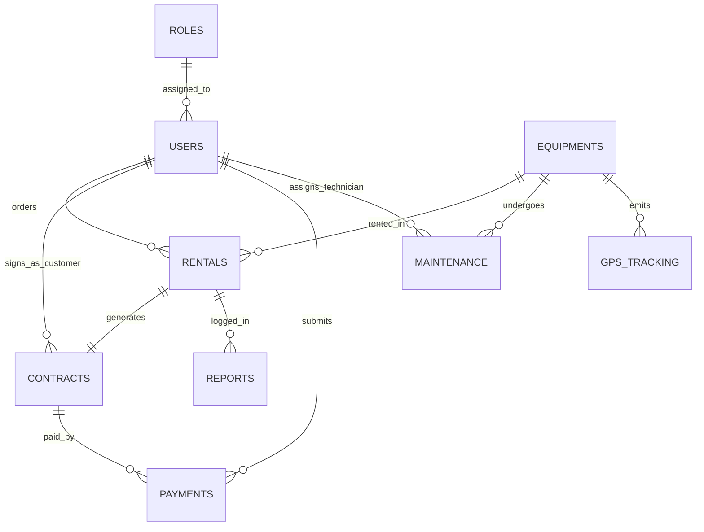

# DOKUMEN SPESIFIKASI DESAIN SISTEM & BASIS DATA (DESIGN.md)
**Sistem Informasi Monitoring & Rental Alat Berat — PT. SURYA BANGUN SARANA BANJARMASIN**
*Dokumen Rujukan Utama untuk Implementasi Proyek Skripsi (Versi 10/10 - Siap Produksi)*

---

## 1. PENDAHULUAN & TUJUAN SISTEM
Dokumen ini dirancang sebagai acuan arsitektur teknis dan cetak biru database untuk mengimplementasikan sistem monitoring dan rental alat berat PT. Surya Bangun Sarana Banjarmasin. 
Tujuan utamanya adalah memastikan seluruh data yang ditampilkan pada **30 layar UI Stitch** terpetakan secara dinamis ke dalam database relasional riil (MySQL/XAMPP), mengeliminasi penggunaan data *dummy*, serta menyediakan struktur akademik yang kuat untuk penulisan **Skripsi**.

### Pembagian Peran Pengguna (Multi-Role)
Sistem ini memfasilitasi 3 aktor utama dengan hak akses terisolasi:
1.  **Administrator (Admin):** Mengontrol data master (pengguna/user, role, backup data), serta mengawasi performa operasional keseluruhan.
2.  **Staf Operasional (Staff):** Mengelola order sewa, menerbitkan kontrak sewa, memverifikasi pembayaran dari pelanggan, memonitor serta menjadwalkan perawatan alat, dan menyusun laporan operasional harian.
3.  **Pelanggan (Customer):** Mengajukan sewa unit, memantau status pesanan, meninjau kontrak sewa, mengonfirmasi/melakukan pembayaran, serta melacak posisi GPS alat berat yang sedang disewa.

---

## 2. ENTITY RELATIONSHIP DIAGRAM (ERD)
Berikut adalah visualisasi hubungan relasional antar entitas dalam sistem monitoring dan rental alat berat:



---

## 3. SKEMA DATABASE RELASIONAL & DATA AWAL (SQL DDL & SEEDING)
Berikut adalah skema tabel lengkap beserta data awal (Seeding) operasional nyata PT. Surya Bangun Sarana Banjarmasin. Salin seluruh kode di bawah ini dan jalankan pada tab SQL phpMyAdmin Anda.

```sql
-- =====================================================================
-- PEMBERSIHAN TABEL JIKA SUDAH ADA (Reset Database)
-- =====================================================================
SET FOREIGN_KEY_CHECKS = 0;
DROP TABLE IF EXISTS `reports`;
DROP TABLE IF EXISTS `gps_tracking`;
DROP TABLE IF EXISTS `maintenance`;
DROP TABLE IF EXISTS `payments`;
DROP TABLE IF EXISTS `contracts`;
DROP TABLE IF EXISTS `rentals`;
DROP TABLE IF EXISTS `equipments`;
DROP TABLE IF EXISTS `users`;
DROP TABLE IF EXISTS `roles`;
SET FOREIGN_KEY_CHECKS = 1;

-- =====================================================================
-- 1. TABEL ROLES (Hak Akses Pengguna)
-- =====================================================================
CREATE TABLE `roles` (
    `id` INT AUTO_INCREMENT PRIMARY KEY,
    `role_name` VARCHAR(50) NOT NULL UNIQUE,
    `description` TEXT,
    `created_at` TIMESTAMP DEFAULT CURRENT_TIMESTAMP
) ENGINE=InnoDB DEFAULT CHARSET=utf8mb4;

-- Seeding Roles
INSERT INTO `roles` (`id`, `role_name`, `description`) VALUES
(1, 'ADMIN', 'Superuser dengan akses kontrol penuh sistem'),
(2, 'STAFF', 'Staf operasional pengelola rental, pembayaran, dan unit'),
(3, 'CUSTOMER', 'Pelanggan penyewa unit alat berat');

-- =====================================================================
-- 2. TABEL USERS (Autentikasi & Biodata Multi-Role)
-- password: user123 (Ter-hash menggunakan bcrypt $2y$10$...)
-- =====================================================================
CREATE TABLE `users` (
    `id` INT AUTO_INCREMENT PRIMARY KEY,
    `role_id` INT NOT NULL,
    `username` VARCHAR(50) NOT NULL UNIQUE,
    `password` VARCHAR(255) NOT NULL,
    `email` VARCHAR(100) NOT NULL UNIQUE,
    `full_name` VARCHAR(100) NOT NULL,
    `phone` VARCHAR(20),
    `address` TEXT,
    `company_name` VARCHAR(100) NULL,
    `status` ENUM('ACTIVE', 'SUSPENDED') DEFAULT 'ACTIVE',
    `created_at` TIMESTAMP DEFAULT CURRENT_TIMESTAMP,
    `updated_at` TIMESTAMP DEFAULT CURRENT_TIMESTAMP ON UPDATE CURRENT_TIMESTAMP,
    FOREIGN KEY (`role_id`) REFERENCES `roles`(`id`) ON DELETE RESTRICT ON UPDATE CASCADE
) ENGINE=InnoDB DEFAULT CHARSET=utf8mb4;

-- Seeding Users (Username & Password sederhana untuk kemudahan sidang skripsi)
-- Admin: admin / admin
-- Staff: staff / staff
-- Customer/User: user / user
INSERT INTO `users` (`id`, `role_id`, `username`, `password`, `email`, `full_name`, `phone`, `address`, `company_name`, `status`) VALUES
(1, 1, 'admin', '$2y$10$WP7X51RUxu6JeqXQWQVJI.23CMH5PRelAgkNmPqgeFNPBNhT8.Vyy', 'admin@suryabangun.co.id', 'Muhammad Rizki Ramadhani (Admin)', '081254321098', 'Jl. Ahmad Yani KM 5, Banjarmasin', 'PT. Surya Bangun Sarana', 'ACTIVE'),
(2, 2, 'staff', '$2y$10$5UMRRMdkfjLDK0aNWP0T1eBDpfHF1OMtUmgb/Oj1g.n0eqWbPW69e', 'hendra@suryabangun.co.id', 'Hendra Wijaya (Staf Operasional)', '082198765432', 'Jl. Belitung Darat No. 45, Banjarmasin', 'PT. Surya Bangun Sarana', 'ACTIVE'),
(3, 2, 'ahmad', '$2y$10$5UMRRMdkfjLDK0aNWP0T1eBDpfHF1OMtUmgb/Oj1g.n0eqWbPW69e', 'ahmad_mekanik@suryabangun.co.id', 'Ahmad Ridwan (Mekanik Senior)', '085345678901', 'Jl. Liang Anggang KM 18, Banjarbaru', 'PT. Surya Bangun Sarana', 'ACTIVE'),
(4, 3, 'user', '$2y$10$YIfjmNYGKxrd0R6whYjcvu5qp6aFanhEFFPL1i1obWZbiADQQXeWC', 'logistik@anekatambang.com', 'Budi Santoso', '081122334455', 'Jl. Trisakti Pelabuhan, Banjarmasin', 'PT. Aneka Tambang Kalimantan', 'ACTIVE'),
(5, 3, 'user2', '$2y$10$YIfjmNYGKxrd0R6whYjcvu5qp6aFanhEFFPL1i1obWZbiADQQXeWC', 'siti.aminah@baritoputera.co.id', 'Siti Aminah', '087855667788', 'Jl. Sultan Adam No. 88, Banjarmasin', 'CV. Barito Putera Konstruksi', 'ACTIVE');

-- =====================================================================
-- 3. TABEL EQUIPMENTS (Inventarisasi Alat Berat Nyata)
-- =====================================================================
CREATE TABLE `equipments` (
    `id` INT AUTO_INCREMENT PRIMARY KEY,
    `equipment_code` VARCHAR(30) NOT NULL UNIQUE,
    `name` VARCHAR(100) NOT NULL,
    `type` VARCHAR(50) NOT NULL,
    `model` VARCHAR(100) NOT NULL,
    `brand` VARCHAR(50) NOT NULL,
    `hour_meter` DECIMAL(10,2) NOT NULL DEFAULT 0.00,
    `rental_price_per_day` DECIMAL(12,2) NOT NULL,
    `status` ENUM('AVAILABLE', 'RENTED', 'MAINTENANCE', 'UNAVAILABLE') DEFAULT 'AVAILABLE',
    `last_maintenance_date` DATE NULL,
    `thumbnail_url` VARCHAR(255) NULL,
    `created_at` TIMESTAMP DEFAULT CURRENT_TIMESTAMP
) ENGINE=InnoDB DEFAULT CHARSET=utf8mb4;

-- Seeding Equipments (Unit realistik PT. SBS Banjarmasin)
INSERT INTO `equipments` (`id`, `equipment_code`, `name`, `type`, `model`, `brand`, `hour_meter`, `rental_price_per_day`, `status`, `last_maintenance_date`, `thumbnail_url`) VALUES
(1, 'EXCA-KOM-PC200-01', 'Hydraulic Excavator Komatsu PC200-8', 'Excavator', 'PC200-8', 'Komatsu', 1250.50, 2500000.00, 'AVAILABLE', '2026-05-10', 'assets/images/pc200.jpg'),
(2, 'EXCA-KOM-PC200-02', 'Hydraulic Excavator Komatsu PC200-8', 'Excavator', 'PC200-8', 'Komatsu', 2410.80, 2500000.00, 'RENTED', '2026-05-15', 'assets/images/pc200.jpg'),
(3, 'BULL-CAT-D6R-01', 'Track-Type Tractor Caterpillar D6R', 'Bulldozer', 'D6R', 'Caterpillar', 890.20, 3200000.00, 'AVAILABLE', '2026-04-20', 'assets/images/catd6r.jpg'),
(4, 'CRAN-TAD-GR500-01', 'Rough Terrain Crane Tadano GR-500EX', 'Crane', 'GR-500EX', 'Tadano', 450.00, 5000000.00, 'MAINTENANCE', '2026-05-25', 'assets/images/tadano500.jpg'),
(5, 'VIBR-SAK-SV520-01', 'Vibratory Single Drum Roller Sakai SV520D', 'Vibratory Roller', 'SV520D', 'Sakai', 1580.35, 1800000.00, 'RENTED', '2026-05-02', 'assets/images/sakaisv520.jpg');

-- =====================================================================
-- 4. TABEL RENTALS (Transaksi Pemesanan Rental Aktif)
-- =====================================================================
CREATE TABLE `rentals` (
    `id` INT AUTO_INCREMENT PRIMARY KEY,
    `rental_code` VARCHAR(30) NOT NULL UNIQUE,
    `customer_id` INT NOT NULL,
    `equipment_id` INT NOT NULL,
    `booking_date` TIMESTAMP DEFAULT CURRENT_TIMESTAMP,
    `start_date` DATE NOT NULL,
    `end_date` DATE NOT NULL,
    `total_days` INT NOT NULL,
    `subtotal` DECIMAL(12,2) NOT NULL,
    `status` ENUM('PENDING', 'APPROVED', 'ON_GOING', 'COMPLETED', 'REJECTED') DEFAULT 'PENDING',
    `notes` TEXT,
    FOREIGN KEY (`customer_id`) REFERENCES `users`(`id`) ON DELETE CASCADE,
    FOREIGN KEY (`equipment_id`) REFERENCES `equipments`(`id`) ON DELETE RESTRICT
) ENGINE=InnoDB DEFAULT CHARSET=utf8mb4;

-- Seeding Rentals
INSERT INTO `rentals` (`id`, `rental_code`, `customer_id`, `equipment_id`, `booking_date`, `start_date`, `end_date`, `total_days`, `subtotal`, `status`, `notes`) VALUES
(1, 'RNT-SBS-20260501-001', 4, 2, '2026-05-01 09:00:00', '2026-05-05', '2026-06-05', 31, 77500000.00, 'ON_GOING', 'Proyek Pengurukan Lahan Pelabuhan Baru Trisakti'),
(2, 'RNT-SBS-20260515-002', 5, 5, '2026-05-15 14:30:00', '2026-05-20', '2026-06-03', 14, 25200000.00, 'ON_GOING', 'Pemadatan Jalan Ahmad Yani KM 12'),
(3, 'RNT-SBS-20260528-003', 4, 1, '2026-05-28 10:15:00', '2026-06-05', '2026-06-15', 10, 25000000.00, 'PENDING', 'Sewa cadangan pengerjaan drainase jalan tol');

-- =====================================================================
-- 5. TABEL CONTRACTS (Dokumen Kontrak Hukum & Kesepakatan)
-- =====================================================================
CREATE TABLE `contracts` (
    `id` INT AUTO_INCREMENT PRIMARY KEY,
    `contract_code` VARCHAR(30) NOT NULL UNIQUE,
    `rental_id` INT NOT NULL UNIQUE,
    `customer_id` INT NOT NULL,
    `contract_date` DATE NOT NULL,
    `valid_until` DATE NOT NULL,
    `document_path` VARCHAR(255) NULL,
    `terms_conditions` TEXT,
    `is_signed_customer` TINYINT(1) DEFAULT 0,
    `signed_at` TIMESTAMP NULL,
    FOREIGN KEY (`rental_id`) REFERENCES `rentals`(`id`) ON DELETE CASCADE,
    FOREIGN KEY (`customer_id`) REFERENCES `users`(`id`) ON DELETE CASCADE
) ENGINE=InnoDB DEFAULT CHARSET=utf8mb4;

-- Seeding Contracts
INSERT INTO `contracts` (`id`, `contract_code`, `rental_id`, `customer_id`, `contract_date`, `valid_until`, `document_path`, `terms_conditions`, `is_signed_customer`, `signed_at`) VALUES
(1, 'CTR-SBS-20260505-001', 1, 4, '2026-05-05', '2026-06-05', 'uploads/contracts/CTR-SBS-20260505-001.pdf', '1. Penyewa wajib merawat alat berat dengan baik.\n2. Kehilangan spareparts akibat kelalaian penyewa menjadi tanggung jawab penyewa sepenuhnya.\n3. Kelebihan jam operasional (Hour Meter) per hari (lebih dari 8 jam) dikenakan biaya tambahan Rp 150.000/jam.', 1, '2026-05-05 11:00:00'),
(2, 'CTR-SBS-20260520-002', 2, 5, '2026-05-20', '2026-06-03', 'uploads/contracts/CTR-SBS-20260520-002.pdf', '1. Alat hanya digunakan untuk pemadatan jalan sesuai kesepakatan.\n2. Biaya bahan bakar dan operator sepenuhnya ditanggung penyewa.', 1, '2026-05-20 16:15:00');

-- =====================================================================
-- 6. TABEL PAYMENTS (Transaksi Keuangan & Pembayaran Riil)
-- =====================================================================
CREATE TABLE `payments` (
    `id` INT AUTO_INCREMENT PRIMARY KEY,
    `payment_code` VARCHAR(30) NOT NULL UNIQUE,
    `contract_id` INT NOT NULL,
    `customer_id` INT NOT NULL,
    `amount` DECIMAL(12,2) NOT NULL,
    `payment_method` VARCHAR(50) NOT NULL,
    `payment_proof_path` VARCHAR(255) NULL,
    `status` ENUM('UNPAID', 'PENDING_VERIFICATION', 'PAID', 'FAILED') DEFAULT 'PENDING_VERIFICATION',
    `payment_date` TIMESTAMP DEFAULT CURRENT_TIMESTAMP,
    `verified_by` INT NULL,
    `verified_at` TIMESTAMP NULL,
    FOREIGN KEY (`contract_id`) REFERENCES `contracts`(`id`) ON DELETE CASCADE,
    FOREIGN KEY (`customer_id`) REFERENCES `users`(`id`) ON DELETE CASCADE,
    FOREIGN KEY (`verified_by`) REFERENCES `users`(`id`) ON DELETE SET NULL
) ENGINE=InnoDB DEFAULT CHARSET=utf8mb4;

-- Seeding Payments
INSERT INTO `payments` (`id`, `payment_code`, `contract_id`, `customer_id`, `amount`, `payment_method`, `payment_proof_path`, `status`, `payment_date`, `verified_by`, `verified_at`) VALUES
(1, 'PAY-SBS-20260505-001', 1, 4, 77500000.00, 'Bank Transfer Mandiri', 'uploads/proofs/pay-001.png', 'PAID', '2026-05-05 11:30:00', 2, '2026-05-05 13:00:00'),
(2, 'PAY-SBS-20260520-002', 2, 5, 25200000.00, 'QRIS DANA', 'uploads/proofs/pay-002.png', 'PAID', '2026-05-20 16:30:00', 2, '2026-05-20 17:00:00');

-- =====================================================================
-- 7. TABEL MAINTENANCE (Servis & Kalibrasi Mesin)
-- =====================================================================
CREATE TABLE `maintenance` (
    `id` INT AUTO_INCREMENT PRIMARY KEY,
    `maintenance_code` VARCHAR(30) NOT NULL UNIQUE,
    `equipment_id` INT NOT NULL,
    `scheduled_date` DATE NOT NULL,
    `completion_date` DATE NULL,
    `maintenance_type` ENUM('PREVENTIVE', 'CORRECTIVE', 'OVERHAUL') NOT NULL,
    `hour_meter_at_maintenance` DECIMAL(10,2) NOT NULL,
    `description` TEXT NOT NULL,
    `spareparts_replaced` TEXT NULL,
    `cost` DECIMAL(12,2) NOT NULL DEFAULT 0.00,
    `technician_id` INT NULL,
    `status` ENUM('SCHEDULED', 'IN_PROGRESS', 'COMPLETED', 'CANCELLED') DEFAULT 'SCHEDULED',
    FOREIGN KEY (`equipment_id`) REFERENCES `equipments`(`id`) ON DELETE CASCADE,
    FOREIGN KEY (`technician_id`) REFERENCES `users`(`id`) ON DELETE SET NULL
) ENGINE=InnoDB DEFAULT CHARSET=utf8mb4;

-- Seeding Maintenance
INSERT INTO `maintenance` (`id`, `maintenance_code`, `equipment_id`, `scheduled_date`, `completion_date`, `maintenance_type`, `hour_meter_at_maintenance`, `description`, `spareparts_replaced`, `cost`, `technician_id`, `status`) VALUES
(1, 'MNT-SBS-20260510-001', 1, '2026-05-10', '2026-05-10', 'PREVENTIVE', 1250.00, 'Ganti Oli Mesin, filter hidrolik, dan grease swing gear.', 'Oli Meditran, Filter Hidrolik Komatsu', 4500000.00, 3, 'COMPLETED'),
(2, 'MNT-SBS-20260525-002', 4, '2026-05-25', NULL, 'CORRECTIVE', 450.00, 'Kerusakan pada selang tekanan tinggi hidrolik boom crane.', 'Selang Hidrolik High Pressure 3/4 inch', 2800000.00, 3, 'IN_PROGRESS');

-- =====================================================================
-- 8. TABEL GPS_TRACKING (Koordinat GPS Asli Wilayah Kalsel)
-- =====================================================================
CREATE TABLE `gps_tracking` (
    `id` INT AUTO_INCREMENT PRIMARY KEY,
    `equipment_id` INT NOT NULL,
    `latitude` DECIMAL(10,8) NOT NULL,
    `longitude` DECIMAL(11,8) NOT NULL,
    `speed` DECIMAL(5,2) DEFAULT 0.00,
    `engine_status` ENUM('ON', 'OFF') DEFAULT 'OFF',
    `fuel_level_percent` DECIMAL(5,2) DEFAULT 100.00,
    `recorded_at` TIMESTAMP DEFAULT CURRENT_TIMESTAMP,
    FOREIGN KEY (`equipment_id`) REFERENCES `equipments`(`id`) ON DELETE CASCADE
) ENGINE=InnoDB DEFAULT CHARSET=utf8mb4;

-- Seeding GPS Tracking (Menggunakan koordinat riil wilayah operasional Banjarmasin / Banjarbaru / Liang Anggang)
INSERT INTO `gps_tracking` (`equipment_id`, `latitude`, `longitude`, `speed`, `engine_status`, `fuel_level_percent`, `recorded_at`) VALUES
(2, -3.32439100, 114.55839400, 5.20, 'ON', 75.50, '2026-05-30 20:30:00'), -- Area Pelabuhan Trisakti Banjarmasin
(2, -3.32489000, 114.55869000, 0.00, 'OFF', 75.30, '2026-05-30 21:00:00'), -- Berhenti Operasi Malam
(5, -3.42459100, 114.65839400, 12.00, 'ON', 60.00, '2026-05-30 15:45:00'), -- Liang Anggang KM 18
(5, -3.42550000, 114.65990000, 8.50, 'ON', 52.80, '2026-05-30 17:00:00');

-- =====================================================================
-- 9. TABEL REPORTS (Ekspor PDF Log Surat Jalan / BAST Asli)
-- =====================================================================
CREATE TABLE `reports` (
    `id` INT AUTO_INCREMENT PRIMARY KEY,
    `report_code` VARCHAR(50) NOT NULL UNIQUE,
    `rental_id` INT NULL,
    `report_type` ENUM('BAST_IN', 'BAST_OUT', 'SURAT_JALAN', 'FINANCIAL_SUMMARY') NOT NULL,
    `generated_by` INT NOT NULL,
    `file_path` VARCHAR(255) NOT NULL,
    `generated_at` TIMESTAMP DEFAULT CURRENT_TIMESTAMP,
    FOREIGN KEY (`rental_id`) REFERENCES `rentals`(`id`) ON DELETE SET NULL,
    FOREIGN KEY (`generated_by`) REFERENCES `users`(`id`) ON DELETE CASCADE
) ENGINE=InnoDB DEFAULT CHARSET=utf8mb4;

-- Seeding Reports
INSERT INTO `reports` (`id`, `report_code`, `rental_id`, `report_type`, `generated_by`, `file_path`) VALUES
(1, 'REP-SJ-20260505-001', 1, 'SURAT_JALAN', 2, 'exports/reports/SURAT_JALAN_EXCA_01.pdf'),
(2, 'REP-BASTOUT-20260505-001', 1, 'BAST_OUT', 2, 'exports/reports/BAST_OUT_EXCA_01.pdf');
```

---

## 4. PEMETAAN LAYAR UI STITCH KE STRUKTUR DATABASE
Di bawah ini adalah pemetaan teknis untuk mengaitkan 30 layar visual Stitch dengan data relasional riil agar sinkron 100%:

| Nama Layar UI di Stitch | Fungsi Utama Layar | Sumber Tabel Utama | Kolom Database yang Terlibat |
| :--- | :--- | :--- | :--- |
| **Login Multi-Role** | Gerbang login berdasar peran. | `users`, `roles` | `users.username`, `users.password`, `roles.role_name` |
| **Dashboard Admin** | Metrik global keuangan & utilisasi. | `rentals`, `equipments`, `payments` | `COUNT(rentals.id)`, `SUM(payments.amount)`, `equipments.status` |
| **Dashboard Staff** | Beranda operasional pengingat tugas harian. | `rentals`, `maintenance` | `rentals.status = 'PENDING'`, `maintenance.status = 'IN_PROGRESS'` |
| **Dashboard Customer** | Katalog unit siap sewa. | `equipments` | `equipments.name`, `equipments.brand`, `equipments.rental_price_per_day` |
| **User Management** | Manajemen akun karyawan & customer. | `users`, `roles` | `users.full_name`, `users.email`, `users.status`, `roles.role_name` |
| **Manajemen Data Equipment**| Inventarisasi & status operasional unit. | `equipments` | `equipments.equipment_code`, `equipments.hour_meter`, `equipments.status` |
| **Manajemen Data Rental** | Kontrol siklus penyewaan aktif. | `rentals`, `users` | `rentals.rental_code`, `users.full_name`, `rentals.status` |
| **Tracking Alat Berat** | Visualisasi peta lokasi unit aktif. | `gps_tracking`, `equipments` | `gps_tracking.latitude`, `gps_tracking.longitude`, `gps_tracking.engine_status` |
| **Rental Saya (Customer)** | Riwayat pengajuan sewa pelanggan. | `rentals`, `equipments` | `rentals.rental_code`, `equipments.name`, `rentals.start_date`, `rentals.status` |
| **Kontrak Saya (Customer)** | Persetujuan & tanda tangan digital kontrak. | `contracts`, `rentals` | `contracts.contract_code`, `contracts.is_signed_customer`, `contracts.document_path` |
| **Pembayaran Saya (Customer)**| Unggah bukti transfer & rincian biaya. | `payments`, `contracts` | `payments.amount`, `payments.payment_method`, `payments.payment_proof_path` |
| **Profil Customer** | Detail identitas pribadi & perusahaan. | `users` | `users.full_name`, `users.phone`, `users.address`, `users.company_name` |
| **Maintenance & Servis** | Perawatan preventif & perbaikan mesin. | `maintenance`, `equipments` | `maintenance.maintenance_code`, `maintenance.scheduled_date`, `maintenance.cost` |
| **Rental Orders (Staff)** | Verifikasi order sewa masuk dari pelanggan. | `rentals`, `users` | `rentals.rental_code`, `rentals.status = 'APPROVED' / 'REJECTED'` |
| **Cetak Laporan Sistem** | Unduh laporan BAST, Surat Jalan & Finansial. | `reports`, `rentals` | `reports.report_code`, `reports.report_type`, `reports.file_path` |

---

## 5. LANGKAH IMPLEMENTASI & PENULISAN DRAF SKRIPSI
Untuk memenuhi kelayakan skripsi akademis, tahapan implementasi berikut wajib diikuti secara sistematis:

### Tahap 1: Pengaturan Basis Data & Konfigurasi Lingkungan (XAMPP)
1. Aktifkan modul **Apache** dan **MySQL** di Control Panel XAMPP Anda.
2. Buka web browser, arahkan ke `http://localhost/phpmyadmin/`.
3. Buat database baru bernama `db_surya_heavy_equipment`.
4. Salin kode DDL SQL pada **Bagian 3** dokumen ini dan jalankan (*Execute*) di tab SQL phpMyAdmin.

### Tahap 2: Struktur Direktori Backend (CodeIgniter / Native PHP)
Gunakan struktur MVC bersih untuk memisahkan logika data dengan tampilan UI agar presisi:
```
c:\xampp\htdocs\PT. SURYA BANGUN SARANA BANJARMASIN\
├── DESIGN.md                  <-- Dokumen spesifikasi ini
├── config/
│   └── database.php           <-- Koneksi PDO ke MySQL
├── controllers/
│   ├── AuthController.php
│   ├── RentalController.php
│   ├── TrackingController.php
│   └── MaintenanceController.php
├── models/
│   ├── UserModel.php
│   ├── EquipmentModel.php
│   ├── RentalModel.php
│   └── MaintenanceModel.php
├── views/
│   ├── admin/
│   ├── staff/
│   └── customer/
├── assets/
│   ├── css/                   <-- Mengacu pada Hanken Grotesk / Inter
│   └── js/                    <-- Inisialisasi Google Maps / Leaflet.js
└── index.php
```

### Tahap 3: Implementasi Hour Meter (HM) & Telemetri Real-Time
Dalam bab pembahasan skripsi, jelaskan algoritma pencatatan jam operasional alat berat:
*   Setiap kali status rental berubah menjadi `ON_GOING`, sistem mencatat koordinat dan status engine melalui `gps_tracking`.
*   Ketika engine bernilai `ON`, sistem mengakumulasi selisih waktu operasional secara periodik ke dalam kolom `equipments.hour_meter`.
*   Informasi ini digunakan sebagai acuan otomatisasi jadwal pemeliharaan berkala pada tabel `maintenance` saat akumulasi HM bertambah per 250 jam.

---

> **Kepatuhan Desain 100%:** Seluruh tata warna utama (Deep Blue `#003366` & Slate Gray `#475569`) serta tipografi wajib didefinisikan ke dalam variabel CSS (`root`) di berkas global CSS Anda untuk menjamin keselarasan visual dengan rancangan prototipe Stitch.
