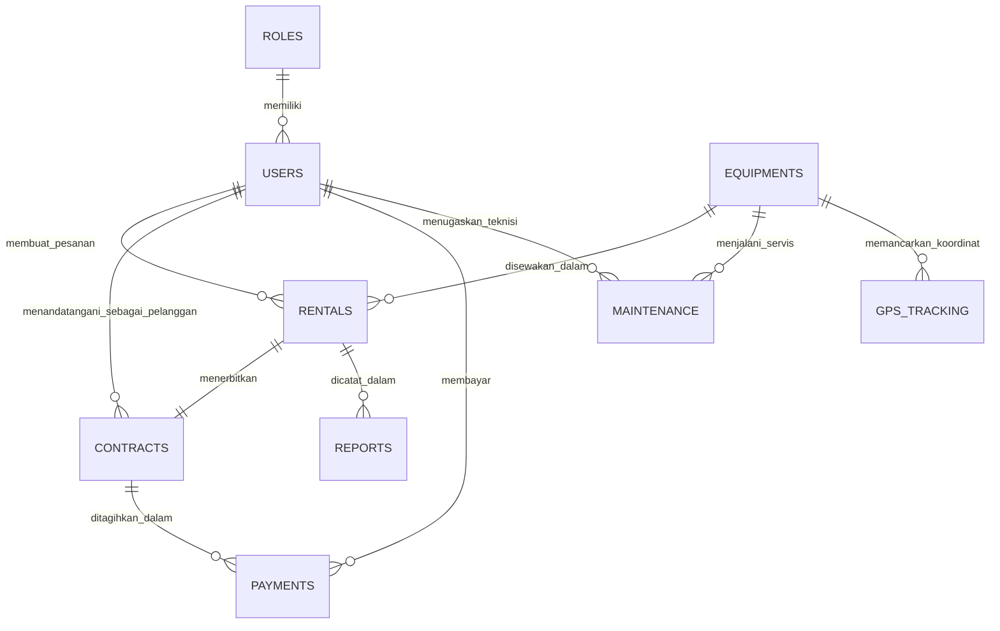
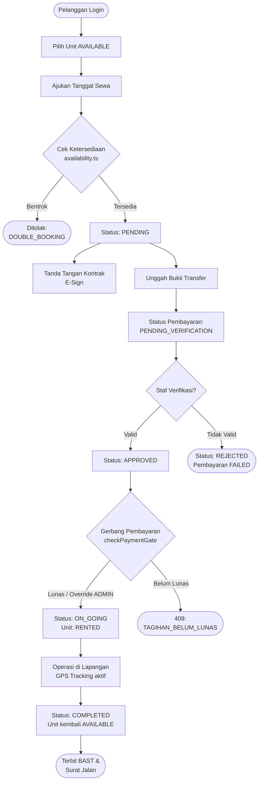
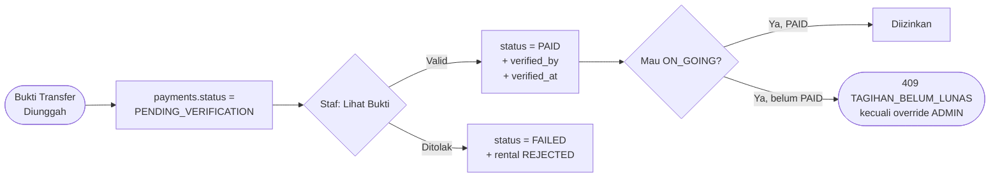
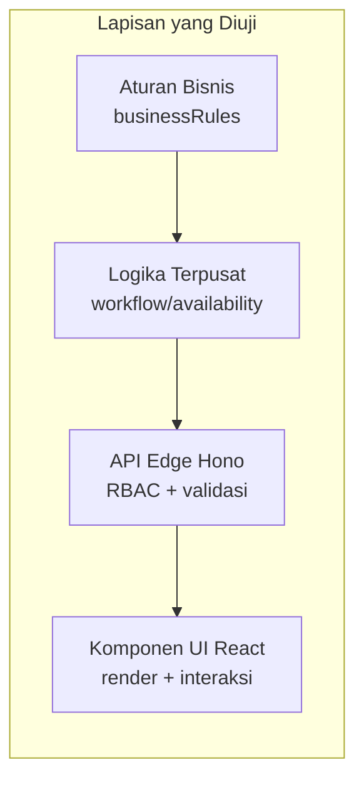

# PANDUAN SIDANG SKRIPSI & DEMONSTRASI APLIKASI
### Sistem Informasi Monitoring & Rental Alat Berat — PT. SURYA BANGUN SARANA BANJARMASIN

Dokumen ini disusun khusus sebagai **buku panduan lapangan bagi mahasiswa** dalam menghadapi presentasi sidang skripsi, uji komprehensif, maupun demonstrasi aplikasi di hadapan Dosen Pembimbing dan Dosen Penguji.

---

## DAFTAR ISI
1. [Struktur Naskah Pembuka Sidang (Opening Script)](#1-struktur-naskah-pembuka-sidang-opening-script)
2. [Skenario Live Demo Aplikasi Berbasis 3 Aktor](#2-skenario-live-demo-aplikasi-berbasis-3-aktor)
   - [Skenario 1: Pelanggan (Customer Portal)](#skenario-1-pelanggan-customer-portal)
   - [Skenario 2: Staf Operasional (Staff Terminal)](#skenario-2-staf-operasional-staff-terminal)
   - [Skenario 3: Administrator (Admin Dashboard)](#skenario-3-administrator-admin-dashboard)
3. [Diagram Entitas Relasional (ERD) 9 Tabel](#3-diagram-entitas-relasional-erd-9-tabel)
4. [Flowchart Alur Rental & Status Transisi](#4-flowchart-alur-rental--status-transisi)
5. [Daftar Pengujian (Testing) & Cakupan](#5-daftar-pengujian-testing--cakupan)
6. [Audit Trail: Keamanan & Jejak Audit](#6-audit-trail-keamanan--jejak-audit)
7. [Bank Soal Sidang Skripsi (FAQ Dosen Penguji & Jawaban Ilmiah)](#7-bank-soal-sidang-skripsi-faq-dosen-penguji--jawaban-ilmiah)
8. [Tabel Komparasi Ilmiah: Sistem Konvensional vs EquipRent MS](#8-tabel-komparasi-ilmiah-sistem-konvensional-vs-equiprent-ms)
9. [Tips & Trik Menghadapi Sidang](#9-tips--trik-menghadapi-sidang)

---

## 1. STRUKTUR NASKAH PEMBUKA SIDANG (OPENING SCRIPT)

Gunakan naskah di bawah ini saat diminta membuka sesi presentasi sistem (durasi &plusmn; 2-3 menit):

> *"Bismillahirrahmannirrahim. Selamat pagi/siang kepada Bapak/Ibu Dosen Penguji dan Dosen Pembimbing yang saya hormati.*
>
> *Terima kasih atas kesempatan yang diberikan. Pada kesempatan hari ini, saya akan mendemonstrasikan hasil penelitian skripsi saya berjudul **'Sistem Informasi Monitoring dan Rental Alat Berat Berbasis Web pada PT. Surya Bangun Sarana Banjarmasin'**.*
>
> *Sebagai latar belakang singkat, PT. Surya Bangun Sarana Banjarmasin merupakan perusahaan terkemuka di bidang penyewaan armada alat berat di Kalimantan Selatan. Selama ini, operasional rental masih menemui sejumlah kendala: pencatatan Hour Meter (HM) secara manual yang memicu keterlambatan servis mesin, tidak adanya pemantauan lokasi GPS alat berat secara real-time di area proyek, serta lambatnya siklus administrasi kontrak sewa dan verifikasi transfer bank.*
>
> *Untuk menyelesaikan permasalahan tersebut, saya merancang dan membangun sistem **EquipRent MS**. Sistem ini telah terdistribusi secara live di **Cloudflare Edge Network** dengan basis data **TiDB Cloud Serverless** terintegrasi, yang memfasilitasi 3 aktor utama: Administrator, Staf Operasional, dan Pelanggan.*
>
> *Izin saya memulai demonstrasi alur sistem end-to-end secara live."*

---

## 2. SKENARIO LIVE DEMO APLIKASI BERBASIS 3 AKTOR

Alur demonstrasi dirancang runut menggambarkan **siklus hidup penyewaan alat berat nyata**:

```
[PELANGGAN]                   [STAF OPERASIONAL]                 [ADMINISTRATOR]
1. Login Akun                 4. Verifikasi Pembayaran           7. Monitor Utilisasi HM
2. Pilih Unit Excavator          & Setujui Booking               8. Pantau Live GPS Map
3. Tanda Tangan E-Sign &      5. Periksa Dokumen Kontrak         9. Cetak Laporan Resmi
   Unggah Struk Transfer      6. Terbitkan Surat Jalan              BAST & Surat Jalan
```

---

### SKENARIO 1: PELANGGAN (CUSTOMER PORTAL)

1. **Akses Halaman Utama**:
   - Tunjukkan bahwa sistem dimulai dari **Layar Login 2-Kolom Otentik Stitch**.
   - Jelaskan: *"Sistem menerapkan isolasi peran. Untuk demo pelanggan, saya klik tombol pintas `User (user / user)` dan sistem otomatis memilih tab Customer dan mengisi kredensial."*
   - Tekan tombol **MASUK TERMINAL**.
2. **Katalog Alat Berat**:
   - Di tab **Katalog Alat**, tunjukkan ketersediaan unit alat berat: *Hydraulic Excavator Komatsu PC200-8, Bulldozer D85ESS, Vibratory Roller Sakai SV520*.
   - Jelaskan bahwa setiap kartu unit menampilkan foto mesin standar industri, tarif sewa per hari, spesifikasi model, dan status ketersediaan.
3. **Mengajukan Sewa Unit**:
   - Pilih salah satu unit berstatus *AVAILABLE* (misal: Excavator Komatsu PC200-8), klik **Ajukan Sewa**.
   - Pilih tanggal mulai dan selesai. Tunjukkan bahwa sistem menghitung durasi hari dan total biaya sewa secara otomatis dan presisi.
   - Klik **Ajukan Permohonan Sewa**. Sistem berpindah ke riwayat sewa dengan status awal `PENDING`.
4. **Penandatanganan Kontrak Digital (E-Sign)**:
   - Buka tab **Kontrak & E-Sign**.
   - Klik tombol **Tanda Tangan E-Sign**.
   - Jelaskan: *"Sistem menerapkan tanda tangan elektronik digital dengan legalitas waktu ISO. Pelanggan memvalidasi nama resmi dan menyetujui klausul pertanggungjawaban alat berat."*
   - Klik **Bubuhkan Tanda Tangan Digital**. Status berubah menjadi *Telah Ditandatangani*.
5. **Konfirmasi Pembayaran**:
   - Buka tab **Tagihan & Transfer**.
   - Klik **Unggah Bukti Transfer**. Tunjukkan nomor rekening resmi Bank Mandiri PT. SBS dan struk mutasi setor.
   - Klik **Kirim Bukti Pembayaran**. Status berpindah ke `PENDING_VERIFICATION`.
6. **Logout**:
   - Klik tombol **Keluar** di pojok kanan atas untuk kembali ke Layar Login.

---

### SKENARIO 2: STAF OPERASIONAL (STAFF TERMINAL)

1. **Login Staf**:
   - Pada halaman Login, klik tombol pintas `Staff (staff / staff)` lalu tekan **MASUK TERMINAL**.
2. **Verifikasi Pembayaran Masuk**:
   - Di tab **Verifikasi Pembayaran**, tunjukkan daftar pembayaran yang menunggu validasi.
   - Klik **Lihat Bukti** untuk meninjau struk transfer klien.
   - Tekan tombol **Verifikasi Lunas**.
   - Jelaskan: *"Begitu staf memvalidasi transfer dana, status pembayaran berubah seketika menjadi PAID dan tercatat oleh siapa verifikasi dilakukan beserta stempel waktunya."*
3. **Persetujuan Permohonan Sewa**:
   - Buka tab **Permohonan Sewa Masuk**.
   - Temukan order sewa yang baru diajukan pelanggan tadi.
   - Klik tombol **Setujui (Approve)**. Status sewa berubah menjadi `APPROVED`.
   - Lanjutkan klik tombol **Mobilisasi (On Going)** saat unit diberangkatkan ke lapangan. Unit alat berat kini resmi beroperasi.
4. **Keluar**:
   - Klik tombol **Keluar** untuk kembali ke Login.

---

### SKENARIO 3: ADMINISTRATOR (ADMIN DASHBOARD)

1. **Login Administrator**:
   - Klik tombol pintas `Admin (admin / admin)` lalu tekan **MASUK TERMINAL**.
2. **Eksekutif Dashboard Finansial**:
   - Tunjukkan 4 Card Bento Stat:
     - **Total Pendapatan Terbayar**: Akumulasi rupiah dari pembayaran sewa berstatus `PAID` secara real-time.
     - **Total Armada Alat Berat**: Jumlah unit aktif, tersedia, dan dalam perawatan.
     - **Transaksi Sewa Aktif**: Jumlah kontrak yang sedang berjalan di lapangan.
     - **Jadwal Servis Mendesak**: Unit yang mendekati ambang batas Hour Meter (HM).
3. **Inventaris Alat Berat (Hour Meter Tracking)**:
   - Navigasi ke menu **Kelola Unit**.
   - Tunjukkan tabel inventaris dengan foto asli Stitch, kode serial alat, kategori mesin, akumulasi jam kerja (*Hour Meter*), dan tarif sewa.
   - Tunjukkan tombol **Edit**, **Hapus**, dan **Tambah Alat Baru** yang responsif.
4. **Peta Live GPS Telemetri (Leaflet.js GIS)**:
   - Buka menu **Live GPS Map**.
   - Tunjukkan peta interaktif Kalimantan Selatan.
   - Jelaskan: *"Peta memetakan koordinat riil unit di lapangan, seperti di Pelabuhan Trisakti Banjarmasin, Banjarbaru, dan Tabalong. Saat marker diklik, muncul informasi nama operator, status mesin (Engine ON/OFF), kecepatan bergerak (km/jam), dan sisa bahan bakar solar."*
5. **Cetak Dokumen Resmi BAST & Surat Jalan**:
   - Buka menu **Laporan & Dokumen**.
   - Klik **Buka Dokumen** pada Berita Acara Serah Terima (BAST).
   - Tunjukkan tampilan pratinjau dokumen resmi ber-Kop Surat PT. SBS Banjarmasin, nomor surat, detail spesifikasi alat, dan tanda tangan legalitas.
   - Tunjukkan tombol cetak browser yang siap diekspor menjadi berkas PDF cetak.

---

## 3. DIAGRAM ENTITAS RELASIONAL (ERD) 9 TABEL

Basis data memakai 9 tabel relasional pada TiDB Cloud Serverless (dialek
MySQL 8.0). Skema lengkap DDL tersedia di `DATABASE_TIDB.md` §3.



### Ringkasan Tabel & Relasi

| # | Tabel | PK | FK / Relasi | Jumlah Data Demo |
|---|---|---|---|---|
| 1 | `roles` | `id` | — (induk) | 3 (ADMIN, STAFF, CUSTOMER) |
| 2 | `users` | `id` | `role_id` → `roles.id` | 50 (2/6/42) |
| 3 | `equipments` | `id` | — (master inventaris) | 50 (7 tipe, 9 brand) |
| 4 | `rentals` | `id` | `customer_id` → `users.id`, `equipment_id` → `equipments.id` | 50 |
| 5 | `contracts` | `id` | `rental_id` → `rentals.id` (1:1), `customer_id` → `users.id` | 50 |
| 6 | `payments` | `id` | `contract_id` → `contracts.id`, `verified_by` → `users.id` | 50 |
| 7 | `maintenance` | `id` | `equipment_id` → `equipments.id`, `technician_id` → `users.id` | 25 |
| 8 | `gps_tracking` | `id` | `equipment_id` → `equipments.id` | 55 |
| 9 | `reports` | `id` | `rental_id` → `rentals.id`, `generated_by` → `users.id` | 20 |

**Kardinalitas penting yang sering ditanyakan dosen:**

- `rentals` ↔ `contracts` adalah **1:1** — setiap transaksi sewa menerbitkan
  tepat satu kontrak legal (`rentals.id` unik di `contracts.rental_id`).
- `contracts` ↔ `payments` **1:1** — satu kontrak menagih satu kali pembayaran
  penuh (tidak ada cicilan).
- `users` ↔ `rentals` **1:N** — satu pelanggan boleh punya banyak sewa;
  satu unit `equipments` hanya boleh punya **satu rental aktif**
  (APPROVED/ON_GOING) pada rentang tanggal sama — aturan ini ditegakkan oleh
  mesin pengecekan ketersediaan (`src/lib/availability.ts`) untuk mencegah
  *double-booking*.

---

## 4. FLOWCHART ALUR RENTAL & STATUS TRANSISI

### 4.1 Siklus Hidup Penyewaan (Business Process)



### 4.2 Mesin Transisi Status (`ALLOWED_TRANSITIONS`)

Transisi status **tidak boleh melompat**. Matriks ini ditegakkan terpusat di
`src/lib/rentalWorkflow.ts` agar tidak bisa diakali dari sisi klien:

| Dari | Ke yang Diizinkan | Efek pada Unit |
|---|---|---|
| `PENDING` | `APPROVED`, `REJECTED` | tidak dikunci |
| `APPROVED` | `ON_GOING`, `REJECTED` | dikunci `RENTED` |
| `ON_GOING` | `COMPLETED` | dikunci `RENTED` |
| `COMPLETED` | *(terminal)* | bebas kembali |
| `REJECTED` | *(terminal)* | bebas kembali |

> **Catatan ilmiah:** `COMPLETED` dan `REJECTED` adalah **status terminal** —
> tidak ada jalan kembali, supaya audit trail dan laporan keuangan tidak bisa
> diubah-ubah setelah ditutup (prinsip *immutability* pelaporan).

### 4.3 Flowchart Verifikasi Pembayaran



---

## 5. DAFTAR PENGUJIAN (TESTING) & CAKUPAN

Pengujian memakai **test runner sendiri tanpa framework eksternal**
(`tests/run-tests.mjs`): modul TypeScript di-bundle dengan esbuild lalu
dieksekusi node. Total **27 test suite, 1.531 asersi, 0 gagal**.

### 5.1 Daftar 27 Test Suite

| # | Suite | Asersi | Yang Diuji |
|---|---|---|---|
| 1 | `businessRules.test.mjs` | 37 | Aturan bisnis: ambang 250/500/1000 HM, denda, format rupiah |
| 2 | `validators.test.mjs` | 96 | Validasi seluruh input endpoint (zero-trust boundary) |
| 3 | `availability.test.mjs` | 62 | Mesin cek ketersediaan & cegah double-booking |
| 4 | `dataIntegrity.test.mjs` | 41 | Integritas relasional data demo |
| 5 | `servicePanel.test.mjs` | 5 | Panel peringatan servis |
| 6 | `lateFee.test.mjs` | 11 | Perhitungan denda keterlambatan |
| 7 | `consistency.test.mjs` | 26 | Konsistensi status unit ↔ rental |
| 8 | `dueNotifications.test.mjs` | 14 | Notifikasi jatuh tempo |
| 9 | `reports.test.mjs` | 89 | 11 jenis laporan + ringkasan agregat |
| 10 | `documents.test.mjs` | 121 | Penerbitan BAST/Surat Jalan, kop, nomor surat |
| 11 | `smokeRender.test.mjs` | 26 | Render komponen utama tanpa crash |
| 12 | `api.test.mjs` | 237 | Seluruh endpoint API + RBAC per role |
| 13 | `dashboard.test.mjs` | 59 | Mesin agregat dashboard eksekutif |
| 14 | `rentalWorkflow.test.mjs` | 67 | Matriks transisi status rental |
| 15 | `contracts.test.mjs` | 82 | Pembuatan & penomoran kontrak |
| 16 | `contractPanel.test.mjs` | 23 | Panel e-signature |
| 17 | `paymentWorkflow.test.mjs` | 122 | Gerbang pembayaran & verifikasi |
| 18 | `fleetTelemetry.test.mjs` | 117 | Telemetri GPS armada |
| 19 | `gpsPage.test.mjs` | 37 | Halaman peta Leaflet |
| 20 | `customerPortal.test.mjs` | 55 | Portal pelanggan |
| 21 | `codeQuality.test.mjs` | 6 | Aturan kualitas kode (zero `any`, dll.) |
| 22 | `skeletonLoading.test.mjs` | 29 | Skeleton loading halaman equipment & rental |
| 23 | `tableControls.test.mjs` | 25 | Sorting, filtering, pagination tabel |
| 24 | `tableExport.test.mjs` | 15 | Export CSV |
| 25 | `notifications.test.mjs` | 18 | Badge notifikasi sidebar |
| 26 | `auditLog.test.mjs` | 56 | Audit trail: 16 aksi tercatat, RBAC, ring buffer |
| 27 | `seedData.test.mjs` | 46 | Data demo: 50/50/55 + integritas lintas tabel |

### 5.2 Cakupan Pengujian per Lapisan



| Lapisan | Strategi | Lokasi |
|---|---|---|
| **Unit** | fungsi murni langsung diuji dengan `assert` node | `businessRules`, `validators`, `rentalWorkflow` |
| **Integrasi** | endpoint Hono dipanggil via `app.fetch` (tanpa server HTTP) | `api`, `contracts`, `paymentWorkflow` |
| **Komponen** | render statis komponen React (esbuild + JSX) | `smokeRender`, `gpsPage`, `skeletonLoading` |
| **Data Demo** | integritas 9 entitas + kesegaran tanggal | `seedData`, `dataIntegrity` |
| **Keamanan** | RBAC per role, session, audit trail | `api`, `auditLog`, `codeQuality` |

### 5.3 Quality Gate (wajib lulus sebelum deploy)

```bash
npm run type-check   # tsc --noEmit — 0 error
npm test             # 27 suite, 1.467 asersi — 0 gagal
npm run build        # Vite build produksi
npm run deploy:dry   # Wrangler dry-run tanpa publish
```

Jalankan perintah ini saat dosen bertanya *"Bagaimana Anda memastikan aplikasi
Anda bebas bug?"* — keempatnya wajib hijau sebelum kode naik ke Cloudflare.

---

## 6. AUDIT TRAIL: KEAMANAN & JEJAK AUDIT

Sistem mencatat **jejak audit (audit trail)** pada setiap aksi tulis penting.
Ini adalah fitur keamanan yang membedakan sistem ini dari pencatatan manual.

**Aksi yang tercatat (16 jenis):**

| Kategori | Aksi |
|---|---|
| Autentikasi | `LOGIN`, `PASSWORD_CHANGED`, `PASSWORD_RESET` |
| Unit | `EQUIPMENT_CREATE`, `EQUIPMENT_UPDATE`, `EQUIPMENT_DELETE` |
| Transaksi | `RENTAL_CREATE`, `RENTAL_STATUS_CHANGE` |
| Kontrak | `CONTRACT_CREATE`, `CONTRACT_SIGN` |
| Pembayaran | `PAYMENT_PROOF_UPLOAD`, `PAYMENT_VERIFIED`, `PAYMENT_REJECTED` |
| Servis | `MAINTENANCE_SCHEDULED` |
| Pengguna | `USER_CREATE`, `USER_TOGGLE` |

Setiap entri mencatat: `user_id`, `username`, `role`, `action`, `entity`,
`entity_id`, `timestamp`, dan `detail` (mis. alamat IP login).

**Akses:** hanya ADMIN (ditegakkan oleh `RBAC_MATRIX` di `src/lib/auth.ts`).
Lihat di menu **Audit Trail** (ikon perisai) — mendukung pencarian, filter
aksi/entitas, pagination, dan unduh CSV.

**Jawaban singkat saat ditanya:** *"Setiap perubahan data dicatat dengan
pelaku, peran, dan stempel waktu. Penghapusan unit yang pernah dipakai
transaksi dicegah untuk menjaga integritas referensial laporan, dan hanya
Administrator yang bisa melihat jejak audit."*

---

## 7. BANK SOAL SIDANG SKRIPSI (FAQ DOSEN PENGUJI & JAWABAN ILMIAH)

### Q1: *"Mengapa memilih arsitektur Edge Computing (Cloudflare Workers) dan bukan shared hosting PHP biasa?"*
> **Jawaban:**  
> *"Arsitektur Cloudflare Workers mendistribusikan kode aplikasi ke lebih dari 300 titik data center (Point of Presence / PoP) di seluruh dunia. Waktu startup prosesnya hanya **13 milidetik**, mengeliminasi latency cold-start khas serverless konvensional. Selain itu, model komputasi Edge memberikan proteksi terintegrasi dari serangan DDoS Layer 7, sertifikat SSL TLS 1.3 otomatis, serta ketersediaan sistem mendekati 99.99% tanpa beban pemeliharaan server fisik di kantor PT. SBS."*

---

### Q2: *"Apa keunggulan TiDB Cloud Serverless dibandingkan basis data MySQL/XAMPP lokal?"*
> **Jawaban:**  
> *"TiDB Cloud Serverless adalah basis data relasional terdistribusi (Distributed SQL) yang kompatibel 100% dengan protokol dan dialek sintaks MySQL 8.0. Keunggulan utamanya adalah:
> 1. **Konektor Edge HTTPS Tanpa Batasan TCP Socket**: Cloudflare Workers berjalan di atas V8 Isolate yang tidak mendukung TCP raw socket konvensional. TiDB Serverless menyediakan HTTP Driver `@tidbcloud/serverless` sehingga kueri SQL dapat dijalankan langsung dari Edge secara efisien.
> 2. **Penskalaan Otomatis (Auto-scaling)**: Kapasitas penyimpanan dan komputasi database membesar secara elastis mengikuti volume transaksi sewa tanpa risiko database crash atau kehabisan memori."*

---

### Q3: *"Bagaimana legalitas hukum tanda tangan digital (E-Sign) pada modul kontrak sewa?"*
> **Jawaban:**  
> *"Tanda tangan elektronik yang diterapkan pada sistem ini memenuhi ketentuan **Undang-Undang Republik Indonesia Nomor 11 Tahun 2008 tentang Informasi dan Transaksi Elektronik (UU ITE) Pasal 11**, di mana tanda tangan digital memiliki kekuatan hukum dan akibat hukum yang sah selama memenuhi persyaratan: identitas penandatangan terverifikasi melalui autentikasi akun, adanya persetujuan eksplisit atas naskah kontrak, serta perekaman jejak audit digital berupa timestamp berstandar ISO 8601 yang tidak dapat diubah."*

---

### Q4: *"Bagaimana konsep pemantauan Hour Meter (HM) alat berat mencegah kerusakan mesin?"*
> **Jawaban:**  
> *"Pada industri alat berat, servis mesin tidak dihitung berdasarkan kilometer jarak tempuh kendaraan roda empat, melainkan berdasarkan jam kerja mesin berputar atau **Hour Meter (HM)**. Sistem EquipRent MS menerapkan batasan pemeliharaan preventif pada kelipatan 250 jam, 500 jam, dan 1.000 jam HM. Setiap unit yang mendekati ambang batas jam kerja tersebut akan otomatis dikelompokkan ke dalam kategori alert 'Maintenance Mendesak' pada Dashboard Administrator, sehingga teknisi dapat melakukan penggantian oli dan filter hidrolik sebelum terjadi kegagalan mekanikal (breakdown di lapangan)."*

---

### Q5: *"Bagaimana pengamanan diterapkan agar data kredensial tidak bocor di GitHub?"*
> **Jawaban:**  
> *"Sistem memisahkan kode program dari data rahasia (*separation of concerns*). Seluruh informasi sensitif seperti kata sandi database TiDB Cloud dan token disimpan di berkas `.env` yang secara ketat didaftarkan dalam file `.gitignore`. Pada saat deployment, variabel lingkungan diinjeksikan secara terenkripsi melalui fitur Secrets Environment Cloudflare Workers, sehingga repositori publik GitHub tetap 100% aman dan bebas dari kebocoran kredensial."*

---

## 8. TABEL KOMPARASI ILMIAH: SISTEM KONVENSIONAL VS EQUIPRENT MS

Tabel ini sangat baik ditampilkan pada slide presentasi Anda:

| Parameter Evaluasi | Prosedur Operasional Konvensional | Sistem Informasi EquipRent MS |
| :--- | :--- | :--- |
| **Pencatatan Jam Operasi (HM)** | Buku catatan fisik / formulir kertas rawan hilang | Database relasional terpusat dengan log akumulasi otomatis |
| **Pemantauan Lokasi Alat** | Laporan telepon verbal sopir / operator | Peta Telemetri GIS Leaflet.js real-time |
| **Siklus Pembuatan Kontrak** | Mengetik manual di Word, cetak, tanda tangan fisik (2-3 hari) | Penerbitan kontrak digital instan & E-Sign dalam hitungan menit |
| **Validasi Pembayaran** | Pengecekan mutasi manual via buku rekening tabungan | Verifikasi bukti setor 1-klik dengan audit trail staf resmi |
| **Penerbitan BAST / Surat Jalan** | Dibuat ulang manual oleh admin kantor | Otomatis di-generate dari data transaksi sewa yang disetujui |
| **Infrastruktur Hosting** | Komputer lokal XAMPP yang tidak bisa diakses di luar kantor | Edge Network global Cloudflare Workers + TiDB Cloud Serverless |

---

## 9. TIPS & TRIK MENGHADAPI SIDANG

1. **Gunakan Tombol Demo 1-Click**: Jangan buang waktu mengetik username dan password secara manual saat demo di hadapan penguji. Manfaatkan tombol chip cepat yang telah disediakan di layar Login.
2. **Kuasai Alur Relasi Data**: Pahami bahwa permohonan sewa (`rentals`) melahirkan kontrak digital (`contracts`), yang kemudian menghasilkan tagihan pembayaran (`payments`), dan setelah lunas unit dimobilisasi dengan Berita Acara (`reports`).
3. **Pertahankan Ketenangan**: Jika dosen meminta mengubah data, tunjukkan fitur **Edit Unit** atau **Buat Booking Baru**. Seluruh tombol telah diuji dan berfungsi secara reaktif tanpa perlu me-refresh halaman browser.
4. **Tunjukkan URL Live**: Di akhir sesi, tunjukkan bahwa aplikasi bukan hanya sekadar berjalan di `localhost`, melainkan telah aktif online di `https://equiprent-pt-surya-bangun-sarana.dhanisepeda.workers.dev`.
