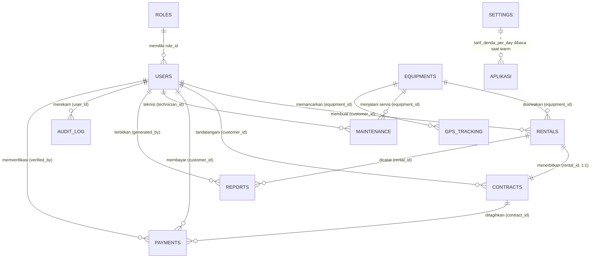
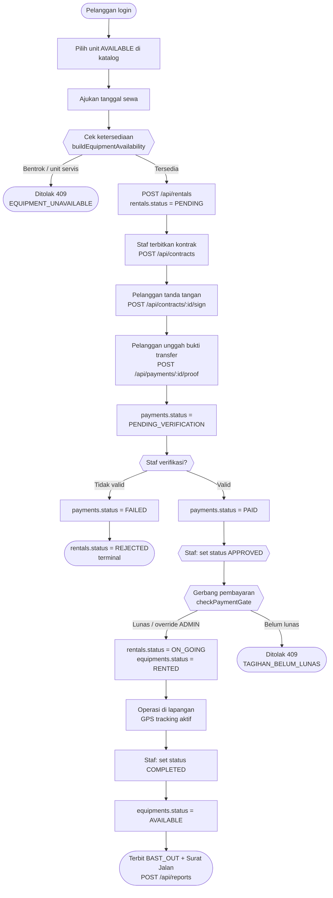
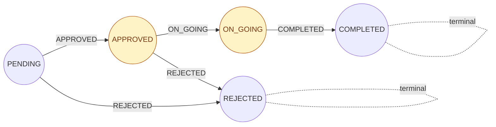
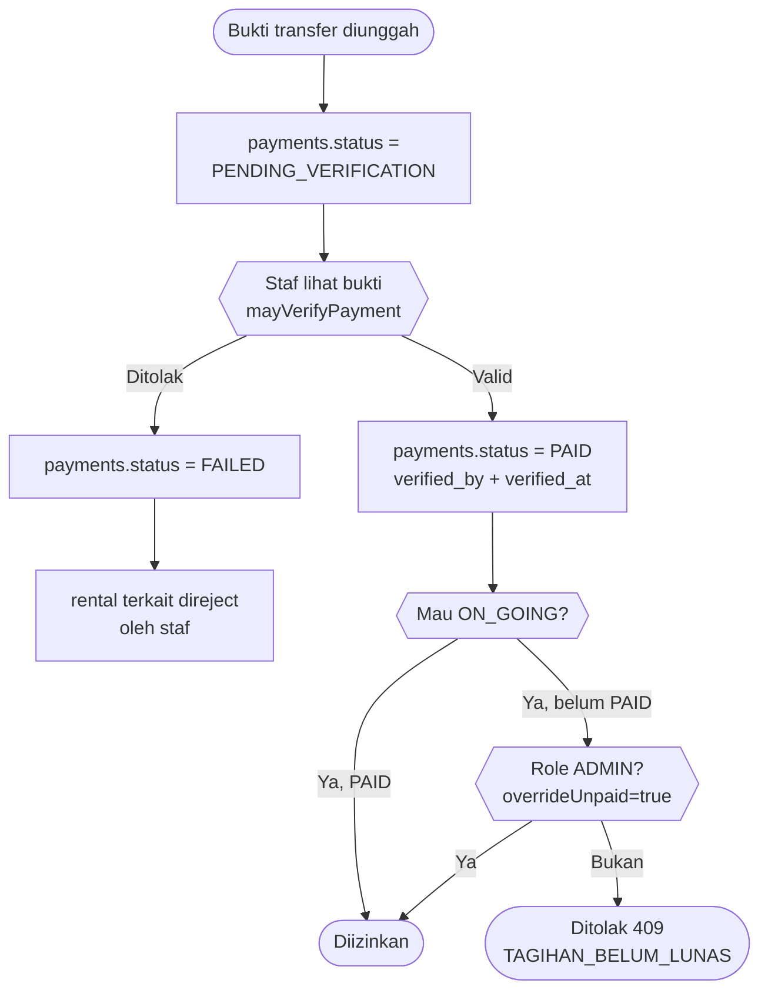
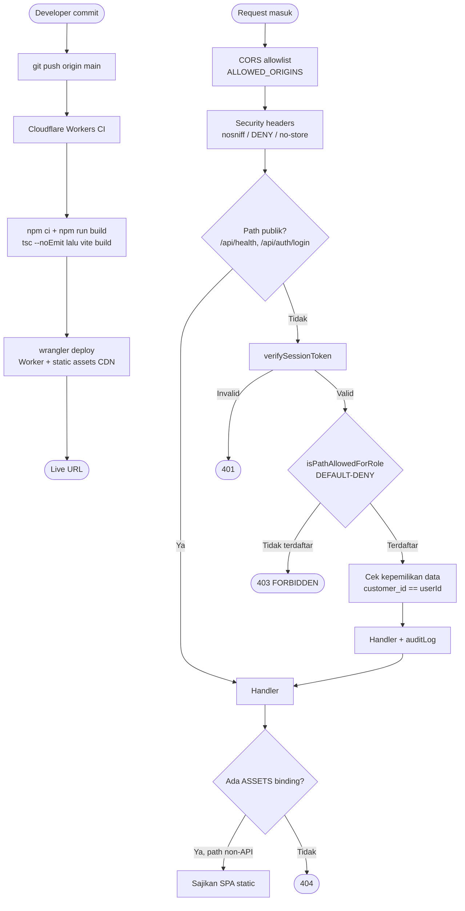

# DIAGRAM SISTEM (ERD & FLOWCHART) — EquipRent MS

### PT. SURYA BANGUN SARANA BANJARMASIN

Sumber kebenaran diagram sistem. Seluruh diagram memakai **Mermaid** (code block)
bukan gambar raster, sehingga dapat di-edit langsung dan dirender oleh GitHub,
VS Code, atau renderer Mermaid mana pun. Diagram ini melengkapi
`PANDUAN_SIDANG_SKRIPSI.md` §3 & §4 dan selalu disinkronkan dengan
`tidb_schema_and_data.sql` serta `src/lib/rentalWorkflow.ts`.

---

## DAFTAR ISI

1. [ERD — 11 Tabel Relasional](#1-erd--11-tabel-relasional)
2. [Flowchart — Siklus Hidup Penyewaan](#2-flowchart--siklus-hidup-penyewaan)
3. [Flowchart — Mesin Transisi Status Rental](#3-flowchart--mesin-transisi-status-rental)
4. [Flowchart — Verifikasi Pembayaran](#4-flowchart--verifikasi-pembayaran)
5. [Flowchart — Pendaftaran Akun & Login](#5-flowchart--pendaftaran-akun--login)
6. [Flowchart — Deploy & Permintaan API (Edge)](#6-flowchart--deploy--permintaan-api-edge)

---

## 1. ERD — 11 Tabel Relasional

Basis data: TiDB Cloud Serverless (kompatibel MySQL 8.0).
Skema DDL lengkap: `tidb_schema_and_data.sql` (11 tabel + 13 indeks).

Tabel `audit_log` dan `settings` adalah tabel operasional yang tidak masuk
diagram 9-tabel inti pada `PANDUAN_SIDANG_SKRIPSI.md` §3, tetapi wajib digambar
di sini karena kedua-duanya ditulis oleh lapisan API (`src/lib/auditLog.ts`
menulis `audit_log`; `warmSettings()` membaca `settings`).



### 1.1 Rincian Kolom per Tabel

```mermaid
erDiagram
    ROLES {
        INT id PK
        VARCHAR role_name UK "ADMIN|STAFF|CUSTOMER"
        TEXT description
        TIMESTAMP created_at
    }
    USERS {
        INT id PK
        INT role_id FK
        VARCHAR username UK
        VARCHAR password "PBKDF2 hash, tidak pernah dikembalikan API"
        VARCHAR email UK
        VARCHAR full_name
        VARCHAR phone
        TEXT address
        VARCHAR company_name "NULL untuk perorangan"
        ENUM status "ACTIVE|SUSPENDED"
        TIMESTAMP created_at
        TIMESTAMP updated_at
    }
    EQUIPMENTS {
        INT id PK
        VARCHAR equipment_code UK
        VARCHAR name
        VARCHAR type
        VARCHAR model
        VARCHAR brand
        DECIMAL hour_meter " jam kerja mesin"
        DECIMAL rental_price_per_day
        ENUM status "AVAILABLE|RENTED|MAINTENANCE|UNAVAILABLE"
        DATE last_maintenance_date
        VARCHAR thumbnail_url
        TIMESTAMP created_at
    }
    RENTALS {
        INT id PK
        VARCHAR rental_code UK
        INT customer_id FK
        INT equipment_id FK
        TIMESTAMP booking_date
        DATE start_date
        DATE end_date
        INT total_days
        DECIMAL subtotal
        ENUM status "PENDING|APPROVED|ON_GOING|COMPLETED|REJECTED"
        TEXT notes
        TIMESTAMP created_at
    }
    CONTRACTS {
        INT id PK
        VARCHAR contract_code UK
        INT rental_id FK_UK "1:1 ke rentals"
        INT customer_id FK
        DATE contract_date
        DATE valid_until
        VARCHAR document_path
        TEXT terms_conditions
        TINYINT is_signed_customer
        TIMESTAMP signed_at
    }
    PAYMENTS {
        INT id PK
        VARCHAR payment_code UK
        INT contract_id FK
        INT customer_id FK
        DECIMAL amount
        VARCHAR payment_method
        VARCHAR payment_proof_path
        ENUM status "UNPAID|PENDING_VERIFICATION|PAID|FAILED"
        TIMESTAMP payment_date
        INT verified_by FK "NULL bila belum diverifikasi"
        TIMESTAMP verified_at
    }
    MAINTENANCE {
        INT id PK
        VARCHAR maintenance_code UK
        INT equipment_id FK
        DATE scheduled_date
        DATE completion_date
        ENUM maintenance_type "PREVENTIVE|CORRECTIVE|OVERHAUL"
        DECIMAL hour_meter_at_maintenance
        TEXT description
        TEXT spareparts_replaced
        DECIMAL cost
        INT technician_id FK "users STAFF (role_id = 2)"
        ENUM status "SCHEDULED|IN_PROGRESS|COMPLETED|CANCELLED"
        TIMESTAMP created_at
    }
    GPS_TRACKING {
        INT id PK
        INT equipment_id FK
        DECIMAL latitude  "10,8"
        DECIMAL longitude "11,8"
        DECIMAL speed
        ENUM engine_status "ON|OFF"
        DECIMAL fuel_level_percent
        TIMESTAMP recorded_at
    }
    REPORTS {
        INT id PK
        VARCHAR report_code UK
        INT rental_id FK "NULL untuk FINANCIAL_SUMMARY"
        ENUM report_type "BAST_IN|BAST_OUT|SURAT_JALAN|FINANCIAL_SUMMARY"
        INT generated_by FK
        VARCHAR file_path
        TIMESTAMP generated_at
        TIMESTAMP created_at
    }
    AUDIT_LOG {
        BIGINT id PK
        INT user_id FK "SET NULL bila user dihapus"
        VARCHAR username "denormalisasi: tetap terbaca"
        VARCHAR role
        VARCHAR action "RENTAL_CREATE|PASSWORD_RESET|..."
        VARCHAR entity
        INT entity_id
        TEXT detail
        TIMESTAMP created_at
    }
    SETTINGS {
        INT id PK
        VARCHAR key UK "contoh: late_penalty_per_day"
        TEXT value
        TIMESTAMP updated_at
    }
```

### 1.2 Catatan Kardinalitas (Sering Ditanyakan Sidang)

| Relasi | Kardinalitas | Penegak di |
| :--- | :--- | :--- |
| `rentals` ↔ `contracts` | **1:1** | `contracts.rental_id` UNIQUE + `canTransition` |
| `contracts` ↔ `payments` | **1:N** (praktik 1:1) | aplikasi: `summarizeRentalPayment` menggabungkan |
| `users` ↔ `rentals` | 1:N | FK `customer_id` |
| `equipments` ↔ `rentals` aktif | **1:1 per rentang tanggal** | `src/lib/availability.ts` cegah double-booking |
| `users` ↔ `audit_log` | 1:N, tapi username disimpan | denormalisasi sadar agar jejak tak hilang |

- `COMPLETED` & `REJECTED` adalah **status terminal** — tak ada transisi
  keluar (prinsip immutability pelaporan).
- `password` tidak pernah dikembalikan oleh API mana pun; endpoint
  `GET /api/users` memakai `ringkasUser()` yang menghapus `password_hash`.

---

## 2. Flowchart — Siklus Hidup Penyewaan

Sumber implementasi: `POST /api/rentals`, `PUT /api/rentals/:id/status`
(`src/server/index.ts`), `src/lib/availability.ts`,
`src/lib/rentalWorkflow.ts`, `src/lib/paymentWorkflow.ts`.



---

## 3. Flowchart — Mesin Transisi Status Rental

Ditegakkan terpusat di `ALLOWED_TRANSITIONS` (`src/lib/rentalWorkflow.ts`),
bukan di kode klien — sehingga loncatan status tidak bisa dilakukan dari UI.



Efek samping per transisi (`getTransitionEffect`):

| Dari → Ke | `equipments.status` | Catatan |
| :--- | :--- | :--- |
| PENDING → APPROVED / REJECTED | tidak dikunci | unit bebas |
| APPROVED → ON_GOING | **RENTED** | wajib lolos cek bentrok + gerbang bayar |
| ON_GOING → COMPLETED | **AVAILABLE** | unit kembali ke pasar |
| COMPLETED / REJECTED | — | terminal, tak bisa diubah |

---

## 4. Flowchart — Verifikasi Pembayaran



> `mayVerifyPayment()` hanya mengembalikan `true` untuk ADMIN & STAFF.
> Pelanggan hanya bisa melihat/mengunggah pembayaran miliknya sendiri
> (`mayTouchPayment()` mengecocokkan `customer_id` dengan `userId` sesi).

---

## 5. Flowchart — Pendaftaran Akun & Login

```mermaid
flowchart TD
    U1([Pengguna membuka halaman login]) --> U2{Punya akun?}
    U2 -- Tidak --> U3[Form "Daftar Akun Pelanggan"]
    U3 --> U4[Pengajuan dikirim ke admin<br/>status: menunggu verifikasi]
    U4 --> U5([Admin aktifkan & tetapkan password<br/>POST /api/users/:id/password])
    U2 -- Ya --> U6[Pilih peran + username/password]
    U6 --> U7[POST /api/auth/login]
    U7 --> U8{{Rate-limit<br/>loginAttempts}}
    U8 -- Terlalu banyak percobaan --> Z6([429 diblokir sementara])
    U8 -- Bawah ambang --> U9{{verifyCredentials<br/>PBKDF2}}
    U9 -- Suspended --> Z7([403 akun dinonaktifkan])
    U9 -- Gagal --> Z8([401 kredensial salah<br/>pesan seragam anti-enumerasi])
    U9 -- Cocok --> U10{Role tab cocok<br/>dengan role akun?}
    U10 -- Tidak --> Z8
    U10 -- Ya --> U11([Terbit session token HMAC-SHA256<br/>header X-Session-Token])
    U11 --> U12[Setiap request berikutnya:<br/>verifySessionToken + RBAC default-deny]
```

---

## 6. Flowchart — Deploy & Permintaan API (Edge)



---

## Cara Merender Ulang

```bash
# VS Code: pasang ekstensi "Markdown Preview Mermaid Support"
# CLI (opsional, bila ingin gambar untuk lampiran skripsi):
npx -p @mermaid-js/mermaid-cli mmdc -i docs/DIAGRAM.md -o erd.png
```

Perubahan skema (`tidb_schema_and_data.sql`) atau alur bisnis
(`rentalWorkflow.ts` / `paymentWorkflow.ts`) **wajib** diikuti perubahan
di berkas ini.
